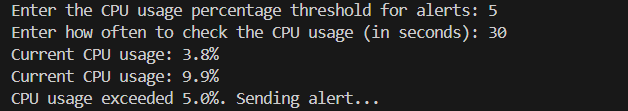
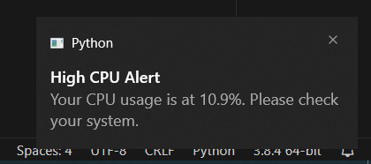

# CPU Usage Monitoring and Notification System

This Python script continuously monitors CPU usage and sends desktop notifications when the CPU usage exceeds a specified threshold.

## Features

- **Real-time CPU Monitoring:** Uses `psutil` to access system CPU usage details.
- **Desktop Notifications:** Uses `plyer` to send notifications directly to your desktop when specified CPU usage thresholds are exceeded.

## Prerequisites

Before you can run this script, you need the following installed:
- Python 3.x
- `psutil` library
- `plyer` library

## Installation

Follow these steps to set up the environment:

1. **Install Python 3.x:**
   - Download and install from [python.org](https://www.python.org/downloads/).

2. **Install Required Libraries:**
   - Open your terminal or command prompt.
   - Run the following commands:
     ```bash
     pip install psutil plyer
     ```

## Configuration

To allow desktop notifications to work properly:

1. **Windows Users:**
   - Go to `Settings` > `System` > `Notifications & actions`.
   - Make sure notifications are turned on and specifically allowed for the application from which you're running the script (like your terminal or Python).

## Usage

1. **Clone or download this repository** to your local machine.

2. **Run the script** from your terminal or command prompt:
   ```bash
   python cpu_usage_monitor.py
   ```


 ## Terminal Text




 ## Desktop Notification




