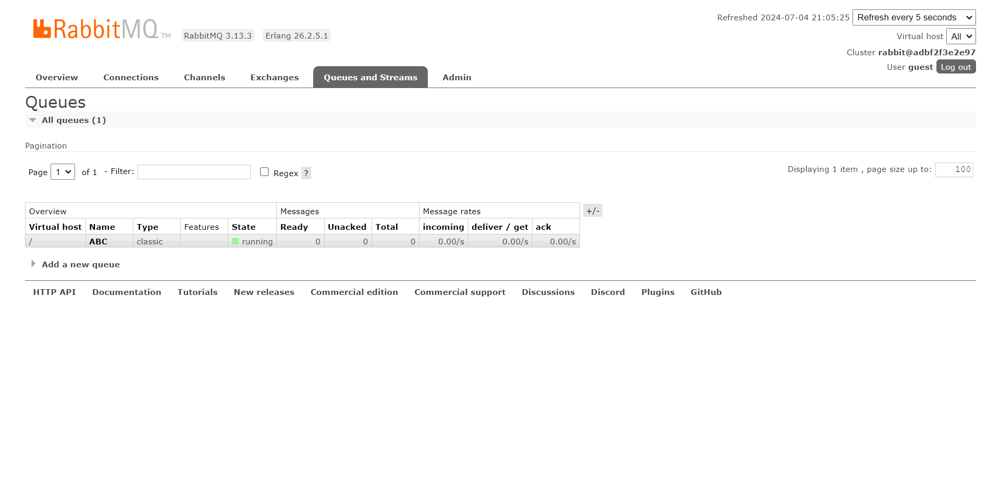

# RabbitMQ Python Publisher and Consumer

This project demonstrates a simple message queuing system using RabbitMQ with Python. It includes a publisher script that sends messages to a specific queue and a consumer script that listens to the queue and prints the received messages.

## Prerequisites

Before running the scripts, ensure you have the following installed:
- Python 3.x
- RabbitMQ Server
- Pika Python library (can be installed via pip)

## Installation

1. ### Install RabbitMQ

If you don't have RabbitMQ installed, you can download and install it from the official [RabbitMQ website](https://www.rabbitmq.com/download.html). Alternatively, you can run RabbitMQ via Docker using the following command:

```bash
docker run -d --name rabbitmq -p 5672:5672 -p 15672:15672 rabbitmq:3-management
```


This command will start RabbitMQ and also expose the management interface at http://localhost:15672 (default login with guest/guest).

2. **Install Pika**:
   - Run `pip install pika` to install the Pika library.

## Configuration

No additional configuration is required for the scripts to run on localhost with default settings. If you are using a remote RabbitMQ server, you will be prompted to enter the host address when running the scripts.

## Usage

1. **Start the Consumer**:
   - Open a terminal and navigate to the directory containing `consumer.py`.
   - Run the script using the command:
     ```
     python consumer.py
     ```

      
   - If prompted, enter the RabbitMQ host address or press Enter to use localhost.

2. **Start the Publisher**:
   - Open another terminal and navigate to the directory containing `publisher.py`.
   - Run the script using the command:
     ```
     python publisher.py
     ```
     
   - Enter the number of messages to send when prompted.
   - If prompted, enter the RabbitMQ host address or press Enter to use localhost.

## Features

- **Publisher.py**: Sends a user-defined number of messages to the 'ABC' queue on the specified RabbitMQ server.
- **Consumer.py**: Listens to the 'ABC' queue and prints any messages that it receives to the console.

## Troubleshooting

- Ensure that the RabbitMQ server is running and accessible from the host running the scripts.
- Check that the Python version is 3.x and that the Pika library is installed correctly.
- If the scripts cannot connect to RabbitMQ, verify the host details and ensure that there are no network issues.


## RabbitMQ UI




